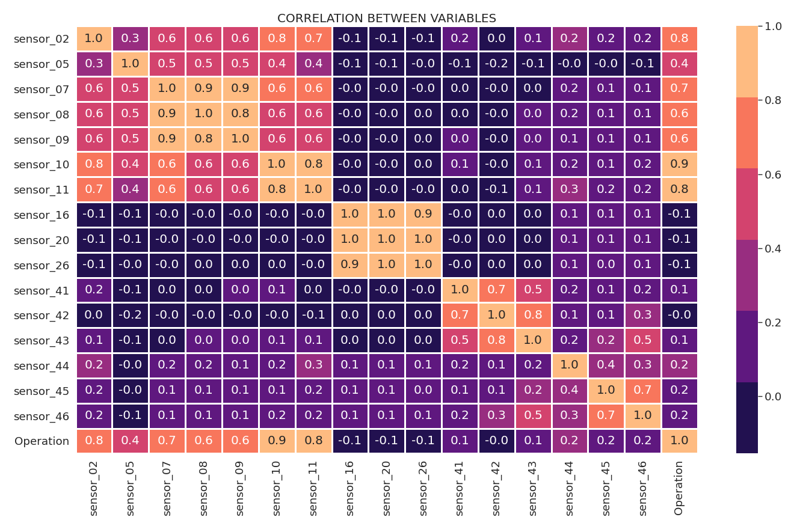

# ToolKit_for_DataScience

The time series dataset is from [Kaggle](https://www.kaggle.com/datasets/nphantawee/pump-sensor-data). 

**Multiple Line Charts**

**Multiple Bar Charts**

**Time Series Visualization**

**Correlation Heatmap**

**Multiple Distribution Charts**

**Multiple Box Charts**

**Feature Importance**

**Missing Values in each Column**

